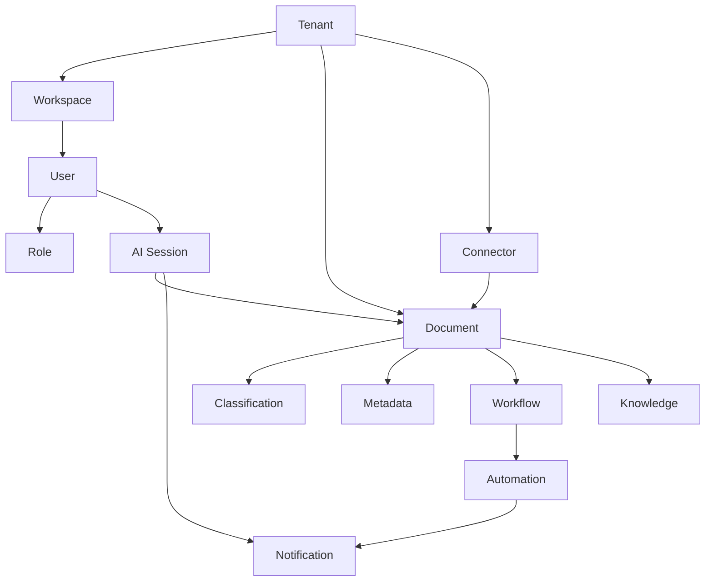
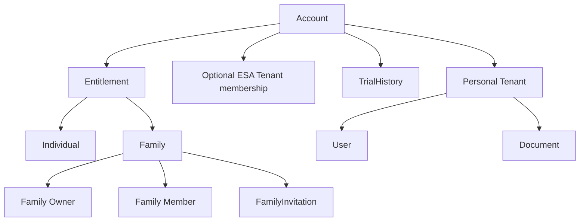

# SA-ARCH-012 — SmartArchive Domain Model

| Field | Value |
|---|---|
| Document ID | SA-ARCH-012 |
| Version | 1.2 |
| Owner | Architecture team — SmartArchive AI Platform |
| Status | **Locked** — constitutional document of Architecture Baseline v1.0 (promoted from Approved on second review, per [SA-ARCH-999](SA-ARCH-999_Architecture_Governance.md) §2). Wave B (2026-08-16) is an additive amendment authorized by Founder review of [ADR-009](adr/ADR-009-account-tenant-family-entitlement.md). Founder alignment after Wave B **Approved** ADR-009. Isolation mechanics (ADR-002) are unchanged. |
| Dependencies | [SA-ARCH-000](SA-ARCH-000_Master_Architecture.md) v1.0, [SA-ARCH-011](SA-ARCH-011_Capability_Map.md), [ADR-009](adr/ADR-009-account-tenant-family-entitlement.md) (**Approved**), [SA-ARCH-014-00](Architecture/SA-ARCH-014_Account_Family_and_Entitlement_Architecture/SA-ARCH-014-00-README.md) (Draft) |
| Purpose | The business-domain language every future document, ADR, and conversation about SmartArchive should share — deliberately not an ERD, not a database schema, not an API contract. Those are downstream of this, not the same as it. |

## How to read this

Each concept below is defined in business terms first. Where a concept is already realized in code, that's noted for orientation — but the definition itself should stay stable even if the underlying implementation changes completely, which is the entire point of having a domain model separate from the schema.

| Status | Meaning |
|---|---|
| **Realized** | A real, working implementation exists that matches this definition |
| **Partial** | Something exists, but only part of the concept is implemented |
| **Conceptual** | The concept is named and understood, but nothing has been built yet |

## The Domain Chain

Document-centric chain (unchanged in role; Tenant remains the isolation boundary for these concepts):

Account / Family / Entitlement chain (ADR-009 — **Conceptual**, not implemented). These records are platform/account-level, not member-Tenant document data:

Family connects Accounts for entitlement and membership. Family is **not** a Tenant and does **not** contain Documents.

## Concepts

### Tenant
The **data-isolation boundary**. Document and other tenant-owned rows are visible only within one Tenant, enforced at the database level via `organization_id` and PostgreSQL RLS — not application filtering alone ([ADR-002](adr/ADR-002-multi-tenancy.md)). Realized today as `Organization` (`backend/app/models/organization.py`).

A Tenant is **not** the durable customer identity (that is Account) and **not** a Family.

**Personal Tenant:** the private SmartArchive archive belonging to one Account. Every Account has exactly one. This remains the RLS isolation boundary for that person’s documents, AI history, and private archive.

**ESA Tenant:** a collaboration Tenant. Distinct from Family. People invited into an ESA Tenant share that Tenant’s documents according to that Tenant’s roles and `authorize()` ([ADR-004](adr/ADR-004-authorization.md)). Family entitlement does **not** automatically apply inside an ESA Tenant.

Tenant-owned document concepts (Document, Workspace, Connector, AI Session as realized today, and so on) belong to exactly one Tenant. **Account, Family, Membership, Invitation, TrialHistory, and Entitlement** are conceptually **platform/account-level** records. They are not member-Tenant document records, must not be exposed through another member’s Tenant, and must not be modeled as ordinary RLS-scoped archive rows. Future implementation must authorize them strictly. Wave B does not implement this and does not modify RLS or migrations.

Wave B note: v1.0 of this document described Tenant as “the organization or customer” and advised preferring “Tenant, not account.” [ADR-009](adr/ADR-009-account-tenant-family-entitlement.md) records that the distinction now matters. Isolation mechanics are unchanged; product meaning is split as above.

**Status: Realized** (isolation as `Organization` + RLS). Personal vs ESA product roles, and Account binding, are **Conceptual** until implementation is authorized.

### Workspace
A sub-division within a Tenant for organizing work — a department, project, site, or branch. Intended as the natural boundary for department-level permissions and, potentially, for how an industry edition's capabilities get scoped within a larger enterprise customer.
**Status: Conceptual** — no `Workspace` model exists today. Documents currently attach to a Tenant through `folder`/`category`, not through an intermediate Workspace layer. **This is an open modeling question**, not an oversight: whether Workspace should exist as its own layer (and how it relates to the still-undecided `B-EXT` industry-edition extension model) should be resolved together with that Wave 0 decision, not designed in isolation here.

### User
An authenticated actor who acts **within a Tenant context**. Distinct from Account (the durable customer identity). Today’s realized `User` row lives in one Organization and is not yet bound to an Account.

An Account may correspond to a User in its Personal Tenant and, optionally, a User membership in an ESA Tenant. Those are Tenant memberships, not Family.

**Status: Realized** as a tenant-scoped actor (`User` model, JWT in `backend/app/security/jwt.py`). Binding to Account is **Conceptual**.

### Role
A named bundle of permissions assigned to a User within a Tenant, evaluated through the single `authorize()` gate ([ADR-004](adr/ADR-004-authorization.md)). Roles are **not** subscription tiers. “Family Owner,” “Family Member,” and plan names are **not** Roles and **not** Permission catalogue entries.

**Status: Realized** — `Role`/`RolePermission`/`Permission` models, ADR-004.

### Document
The core artifact of the platform: binary content plus its metadata record. Everything else in the domain model exists to organize, enrich, act on, or reason about Documents.
**Status: Realized** — `Document` model + MinIO-backed storage (ADR-003), upload/download/delete implemented end to end.

### Classification
The category or type assigned to a Document (contract, invoice, ID, medical record, etc.) — whether assigned by a human or, eventually, by AI.
**Status: Partial** — human assignment exists today via `category_id`/`tag` associations. AI-driven classification is named as a job type (`AIJobType.classification` in `ai_jobs`) but has zero implementation (Wave 1, `B1`).

### Metadata
Structured descriptive data about a Document beyond its classification — title, filename, MIME type, size, and (eventually) extensible custom fields per Tenant or industry edition.
**Status: Partial** — the current field set is fixed and basic; no extensible custom-metadata schema exists yet.

### Workflow
A sequence of automated or human steps a Document (or a broader task) moves through — e.g., upload → review → approval → archival.
**Status: Conceptual** — no `Workflow` model or engine exists. The `DocumentStatus` enum (`uploaded/processing/ready/failed`) is a lifecycle state, not a workflow engine.

### Automation
Rule-based or AI-triggered actions taken in response to events — e.g., "when a document is classified as an invoice, extract the amount and create a reminder."
**Status: Conceptual** — the event bus (`backend/app/events/bus.py`, ADR-005) is the plumbing automation would run on top of, but zero automation rules exist yet; today's bus has zero subscribers by design (ADR-005).

### Knowledge
Relationships, entities, and facts extracted across the document corpus — the Knowledge Graph capability. Depends on both AI (for extraction) and Search (for retrieval) existing first.
**Status: Conceptual** — not started; correctly sequenced last in [SA-ROADMAP-001](SA-ROADMAP-001_Architecture_Roadmap.md) since it depends on Waves 1 (`B1`, `B2`) being real.

### Connector
A named integration with an external system a Tenant already runs (an ERP, CRM, cloud storage, or industry-specific system like an HL7/FHIR feed) — the mechanism behind Integrated Mode (Principle #5).
**Status: Conceptual** — `deployment_mode` on `Organization` shows structural intent; no `Connector` model or interface exists (Wave 1, `B3`, gated on `B-EXT`/`B9-iface` per [SA-ROADMAP-001](SA-ROADMAP-001_Architecture_Roadmap.md)).

### AI Session
A bounded interaction with the AI Gateway — could be a single batch job (an OCR pass, a classification run) or, eventually, a multi-turn conversation (chat, voice) with retained context.
**Status: Conceptual** — `AIJob`/`OCRJob` models are the closest existing concept, but they model one-shot jobs, not sessions with conversation memory. The distinction matters: a future AI Gateway ADR needs to decide whether "session" is a first-class concept from the start or bolted on once chat/voice need it.

### Notification
A message delivered to a User — including, per [SA-ARCH-000](SA-ARCH-000_Master_Architecture.md) §5, reminders that pass through the ACE layer for context-sensitive timing and phrasing ("Calm Cards") before delivery.
**Status: Partial** — `Notification` model exists as schema only; no delivery mechanism or ACE integration is wired up (the ACE layer's actual mechanics remain an honest, stated gap — see SA-ARCH-000 §5).

### Account
Durable customer identity. Trial eligibility, subscription/entitlement state, and Family membership attach to the Account, not to an Organization/Tenant.

An Account may have:

- one Personal Tenant (required);
- optional ESA Tenant membership;
- TrialHistory;
- a subscription/entitlement relationship;
- at most one Family relationship in v1 (as Owner or as Member, not two Families).

Creating another Tenant must not create another Account and must not mint another introductory trial.

**Status: Conceptual** — no Account model exists. Today’s `User`+`Organization` bootstrap is the gap, not the target ([SA-ARCH-014-01](Architecture/SA-ARCH-014_Account_Family_and_Entitlement_Architecture/SA-ARCH-014-01-Account_Architecture.md)).

### Family
An entitlement, billing, and membership group of Accounts. Family is **not** a Tenant, **not** an Organization, **not** a shared archive, and **not** a replacement for RLS.

Family connects Accounts so they can share a Family Package (seats). It does **not** grant access to another member’s documents, document versions, AI analysis, private archive, or private history. The Family Owner manages membership, invitations, seats, Family entitlement, and billing-related Family information, and **consumes one Family seat**. The Owner must not be modeled as `is_superuser` over member Tenants.

v1: adult-only (verification *method* is Open / Deferred — no KYC provider invented here); one Family per Account; seat limit configurable (no numeric default in this document); no member-directory feature; no separate Family trial SKU.

Family invitation is distinct from ESA organization invitation. Accepting a Family invitation does not merge Tenants or archives ([SA-ARCH-014-08](Architecture/SA-ARCH-014_Account_Family_and_Entitlement_Architecture/SA-ARCH-014-08-Family_Invitation_Lifecycle.md)).

**Status: Conceptual.**

### Entitlement
The evaluated product access of an Account: Individual vs Family, seats, trial vs paid. Determined by a future server-side Entitlement Service.

Entitlement is **not** Role, **not** Permission, and **not** Authorization. `authorize()` remains the authorization mechanism ([ADR-004](adr/ADR-004-authorization.md)). Entitlement must not be UI-only logic and must not be implemented as RBAC roles.

Family entitlement does **not** automatically apply to an ESA collaboration Tenant.

**Status: Conceptual** ([SA-ARCH-014-04](Architecture/SA-ARCH-014_Account_Family_and_Entitlement_Architecture/SA-ARCH-014-04-Subscription_and_Entitlement_Service.md)).

### TrialHistory
The durable record that an Account has started, completed, or exhausted its **one** introductory trial. Introductory trial eligibility belongs to the Account, not the Tenant. Creating another Tenant must not create another introductory trial. Joining or creating a Family must not create another introductory trial. There is no separate Family trial SKU in v1.

v1 primary controls: verified Account/email + TrialHistory. Payment instrument is not the v1 identity mechanism.

**Status: Conceptual** ([SA-ARCH-014-05](Architecture/SA-ARCH-014_Account_Family_and_Entitlement_Architecture/SA-ARCH-014-05-Trial_Eligibility_and_History.md)).

## How This Document Should Be Used

- New ADRs and capability write-ups should use these terms consistently — "Document," not "file" or "record." Use **Account** for durable customer identity, **Tenant** for data isolation, **Family** for entitlement/membership, **Entitlement** for product access, **Authorization** / `authorize()` for actions inside a Tenant, **User** for the authenticated actor in a Tenant context. Do not collapse these.
- “Household” / “family member” in product-vision language ([SA-ARCH-013](SA-ARCH-013_Product_Vision_and_Evolution.md)) is audience or future explicit-sharing language. It does **not** mean Family is a shared document Tenant.
- When a Wave 0/1 ADR (`B-EXT`, `B9-iface`, `B1`, `B3`) is written, it should say explicitly which domain concepts it touches or introduces (e.g., does `B-EXT` introduce Workspace as a real concept, or route industry-edition scoping through Tenant directly?) — this document should be revised alongside that ADR if the answer changes what's written here.
- This document does not replace the [SA-ARCH-011](SA-ARCH-011_Capability_Map.md) Capability Map — a capability is *something the platform can do*; a domain concept here is *a thing the platform reasons about*. They're related (most capabilities operate on one or more of these concepts) but answer different questions.

## Open / Deferred (do not invent in this document)

| Topic | Status |
|---|---|
| Exact adult-only verification method / KYC provider | Open / Deferred (Family v1 is adult-only; method is a future Security/Compliance decision) |
| Numeric Family seat default | Open / Deferred (limit is configurable; Owner consumes one seat) |
| Introductory trial duration and included features | Open / Deferred |
| Payment provider / Stripe | Open / Deferred |
| Abuse signal weights / risk engine | Open / Deferred (forbidden as a product in v1; signals may only verify → review → protect) |
| Device fingerprinting, GPS | Not v1 controls |
| Automatic permanent account ban/termination | **Not permitted in v1** (Founder decision; not an open product option) |
| Account recovery design | Open / Deferred |
| Account-level locale vs ADR-008 User → Organization cascade | Open / Deferred |

## Revision History

| Rev | Change |
|---|---|
| 1.0 | Initial domain model, authored as part of Architecture Baseline v1.0. Flagged Workspace as an open modeling question tied to the unresolved `B-EXT` decision, rather than assuming it already exists. |
| 1.1 | Wave B additive amendment (Founder authorization 2026-08-16), authority **ADR-009**. Tenant restated as isolation boundary (ADR-002 unchanged). Added Account, Family, Entitlement, TrialHistory. User distinguished from Account. Role distinguished from entitlement. Platform-level vs tenant-owned records noted. No implementation. |
| 1.2 | Founder alignment after Wave B: cite **ADR-009** as **Approved**. No domain-concept rewrite. No implementation. |
