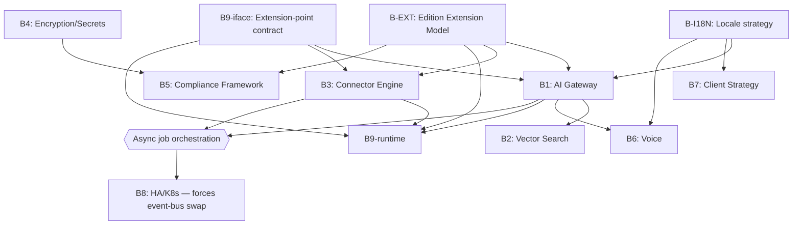
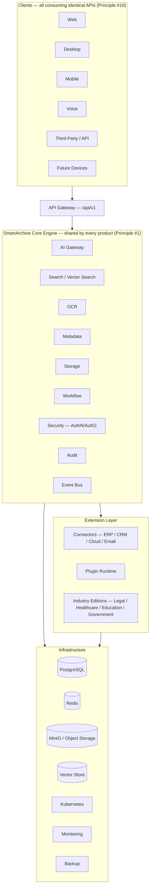

# SA-ROADMAP-001 — Architecture Roadmap (Baseline)

| Field | Value |
|---|---|
| Document ID | SA-ROADMAP-001 |
| Revision | 6 (see Revision History) |
| Status | Approved — part of Architecture Baseline v1.0 (approved 2026-07-30) |
| Derived from | [SA-AUDIT-002](SA-AUDIT-002_Enterprise_Architecture_Audit.md) **Rev 1** (full findings/evidence), [SA-REVIEW-001](SA-REVIEW-001_Milestone1_Principles_Audit.md) (principles gap detail) |
| Purpose | Sequence every recommendation from the audit into a concrete order of operations, so "what do we do next" has one answer instead of fifteen independent ones |

## Revision History

| Rev | Change |
|---|---|
| 0 | Initial linear Track A/B/C sequencing derived from SA-AUDIT-002 Rev 0. |
| 1 | Phase 2 review. Re-sequenced Track B from a flat priority list into dependency-ordered **waves**, based on an explicit coupling analysis (which future documents depend on each item, which implementation waits on it, cost of changing it late). Folded in the two items SA-AUDIT-002 Rev 1 added (§16 Internationalization, §17 Industry/Vertical Edition Extension Model) as first-class Track B items — they were flagged in the audit but never actually added to Track B in Rev 0, which was itself a missing-milestone gap this review caught. Tested the hypothesis that Plugin Architecture (B9) is under-prioritized: **partially confirmed** — split B9 into an interface-design piece that moves into Wave 0 (alongside §17) and a runtime/sandboxing/marketplace piece that stays late (see Dependency Graph and B9 entry below). Added a dependency graph, a full coupling table, and an Architecture Gates section defining what must be true before Stage 2 coding resumes. Per the user's approval of this revision, also added an **Architecture Maturity Matrix** (0-5 rating per subsystem) and a **Target Platform Architecture** end-state diagram, and added A6 to Track A (the `/ready`/MinIO doc-code mismatch). |
| 2 | Stage 2 kickoff. Wave 0's three items drafted as real ADRs (`ADR-006` Platform Extension Model, `ADR-007` Extension Interface & Platform Contracts, `ADR-008` Internationalization) at the user's direction that they be designed together, not in isolation — `B-EXT`'s scope was broadened per the user's insight from "industry editions only" to the general Core-vs-Extension boundary covering every provider/connector/engine type. Added **Stage 2 Success Criteria** and **Milestone S2.0 — Platform Foundation** (the concrete 7-step plan: approve Wave 0 ADRs → finish Track A → build the extension loader → validate with one reference extension, before any large capability is built). Corrected Track A's A5: the original `SAC-ARCH-000 v2.1.0` was never recovered; its goal was met differently, via authoring SA-ARCH-000 v1.0 fresh — noted as resolved-differently rather than left implying still-blocking. |
| 3 | Track A closed out in parallel with the (still-Draft) Wave 0 ADR review, per the user's direction that operational fixes aren't architectural changes and don't need to wait. A1 (stale comment), A2 (frontend CI test — required writing the platform's *first* frontend test, since `vitest` errors on zero test files), A3 (`fail_under=70`, derived from an actual local test run: 73.24% measured, unit-only since no live Postgres/Redis was available in this environment), A4 (DR runbook, `infrastructure/DR_RUNBOOK.md`), and A6 (real MinIO check in `/ready`, not just a docstring fix) are all implemented and verified — backend tests re-run (18 passed, 3 skipped, coverage gate passes) and frontend tests re-run (3 passed) after the changes, not just written and assumed correct. |
| 4 | ADR-006/007/008 Approved after one focused implementation-consequences review (Extension Categories added to ADR-006; Workflow Contract + Platform Dependency Diagram added to ADR-007; broadened formatting/currency/timezone/collation scope added to ADR-008). Milestone S2.0 marked complete. Added **Milestone S2.1 — Reference Extension**, a validation-only milestone (prove the extension model with one real Extension — the Storage Contract is the natural candidate — before AI/Connector/Voice work begins), with explicit acceptance criteria per the user's specification. |
| 5 | Restricted synchronization following the Founder-approved ESA ADR-010–013 Architecture Draft Package (2026-08-29) and its Founder-approved Synchronization Impact Audit (2026-08-30) — Founder explicitly authorized **only** the mechanical ADR-012 Gate 3 addition in this pass (Restriction 2). Added [ADR-012](adr/ADR-012-ai-permission-inheritance.md) as a named Gate 3 security-conformance prerequisite for `B1`, per ADR-012's own stated recommendation. **Explicitly not done in this revision** (each requires a separate Founder roadmap decision): no new Track B wave items for Organizational Hierarchy (ADR-010), Intake (ADR-011), or Scoped Administration; no change to B1/B2/B3 sequencing; no widening of Gate 3 beyond the one ADR-012 citation; no new Dependency Graph edges; no Coupling Analysis changes. |
| 6 | Factual synchronization only, Founder-approved (2026-08-30) — following ADR-011/ADR-007's Approved Intake Contract addition. Wave 0's **B9-iface** row corrected from "9 named Platform Contracts (Storage, Connector, AI Provider, OCR, Authentication, Notification, Search, Voice, Workflow)" to "10 named Platform Contracts (Storage, Connector, AI Provider, OCR, Authentication, Notification, Search, Voice, Workflow, Intake)" — this row had gone stale for the same reason as the SA-ARCH-000 §3/§7 corrections (Rev 1.3/1.4/1.5 of that document), found during that correction's verification pass and reported then, now corrected under this explicit Founder authorization. No other part of the B9-iface row, any Gate, B1/B2/B3, Track B sequencing, the Coupling Analysis, or the Dependency Graph changed. |

## How this roadmap is organized

Three tracks, run partly in parallel:

- **Track A — Now (no dependencies, cheap, do immediately):** mechanical fixes with zero design risk.
- **Track B — Design-before-Stage-2 (must be decided on paper before the corresponding Stage 2 code is written):** as of Rev 1, no longer a flat priority list — it's organized into **dependency-ordered waves** (Wave 0 through Wave 3), each derived from an explicit coupling analysis (see below) rather than convenience-based sequencing.
- **Track C — Stage 2+ implementation:** the actual feature work, which cannot start (per the audit) until its Track B prerequisite is resolved.

A Track C item is not allowed to start before its Track B prerequisite is marked resolved, and a later wave is not allowed to start before every item in the wave before it is resolved — that ordering is the entire point of this roadmap.

---

## Architecture Maturity Matrix

Added in Rev 1, at the user's request, to give future reviews an objective way to measure progress rather than re-deriving "how far along is X" from scratch each time. Scale:

| Level | Meaning |
|---|---|
| 0 | Not started — no code, no design document |
| 1 | Data model or placeholder only — schema/scaffolding exists, zero real logic |
| 2 | Partial implementation — real code, not yet production-hardened |
| 3 | Solid Milestone-1-grade implementation — tested, disciplined, but unproven at real production scale/traffic |
| 4 | Production-proven at real customer scale |
| 5 | Mature — battle-tested, being actively optimized against real operational data |

**Classification** (added per user request — makes the matrix easier to interpret for future contributors at a glance):

| Classification | Level range | Meaning |
|---|---|---|
| Experimental | 0 | Nothing built or only the earliest exploratory scaffolding |
| Emerging | 1-2 | Real progress, not yet production-hardened |
| Production Ready | 3 | Solid, tested, Milestone-1-grade |
| Enterprise Ready | 4 | Proven at real customer scale |
| Strategic | 5 | Mature, battle-tested, a genuine competitive differentiator |

| Area | Level | Classification | Why |
|---|---|---|---|
| Core Engine (multi-tenancy, RLS, auth, module structure) | 3 | Production Ready | RLS isolation empirically tested against a genuinely hard scenario (SA-AUDIT-002 §12), disciplined ADRs, but zero real production traffic yet |
| API (versioning, OpenAPI, UI-independence) | 3 | Production Ready | `/api/v1` from commit one, consistently followed, no violations found |
| Security — authN/authZ specifically | 4 | Enterprise Ready | JWT + bcrypt + centralized `authorize()` gate, genuinely solid |
| Security — encryption/secrets/compliance | 0-1 | Experimental | No TLS, no at-rest encryption, no secrets manager, no compliance framework (SA-AUDIT-002 §7) — blended into an overall **Security: 2-3** band since the authN/authZ strength doesn't offset the encryption/compliance gap |
| AI | 1 | Emerging | `ai_jobs`/`ocr_jobs` schema and job-type enums exist; zero AI Gateway design or implementation |
| Voice | 0 | Experimental | Not started; not even a placeholder directory of its own |
| Connectors | 1 | Emerging | `deployment_mode` enum shows structural intent; zero connector code or interface |
| Plugin Framework | 0 | Experimental | `plugins/` is an empty README stub; no interface design yet (`B9-iface` not written) |
| Mobile / Desktop clients | 1 | Emerging | Backend is transport-agnostic (good foundation) but zero second client exists, no shared design-token system beyond a color scale |
| Infrastructure (Docker/K8s/HA) | 2 | Emerging | Docker Compose setup is genuinely disciplined (healthchecks, resource limits, backup+restore verification); zero Kubernetes/HA |
| Observability | 2 | Emerging | Real Prometheus/Grafana/structured logging/correlation IDs; no SLOs defined, and one health-check doc/code mismatch found (`/ready` claims a MinIO check it doesn't run) |
| Internationalization | 0 | Experimental | Not started; not identified as a gap until this review cycle |
| Compliance (regulatory framework) | 0 | Experimental | Audit logging exists (a compliance building block) but no retention/erasure/residency framework |
| Industry Editions | 0 | Experimental | Unresolved architecturally — see `B-EXT` below |

This matrix should be re-scored at each future architecture review, not just read once — its value is in the trend across reviews, not the snapshot.

---

## Track A — Do Now (this week, no architectural dependencies)

| # | Action | Source |
|---|---|---|
| A1 | ✅ **Done.** Fixed `backend/app/core/tenancy.py:11` stale comment — now points to `backend/alembic/versions/0001_initial_schema.py` | SA-REVIEW-001 §2, SA-AUDIT-002 §15 |
| A2 | ✅ **Done.** Added a `Test` step (`npm run test`) to the frontend CI job. Required writing the platform's first frontend test (`frontend/src/store/authStore.test.ts`) since none existed — `vitest run` errors on zero test files by default, so this wasn't just a CI config change | SA-REVIEW-001 §3, SA-AUDIT-002 §12 |
| A3 | ✅ **Done.** `fail_under = 70` set in `backend/pyproject.toml`, derived from an actual local test run (73.24% measured 2026-07-30, unit tests only — no live Postgres/Redis in this environment, so `@requires_test_db` integration tests were skipped, same as `TEST_DATABASE_URL` being unset does in CI's absence). Documented in a `pyproject.toml` comment that real CI (which does run against live services) should be re-measured and this threshold raised toward the 80% target once that number is known | SA-AUDIT-002 §12 |
| A4 | ✅ **Done.** [`infrastructure/DR_RUNBOOK.md`](../infrastructure/DR_RUNBOOK.md) — RPO 24h / RTO 4h (deliberately modest, pre-production-appropriate targets), recovery procedure, quarterly + on-schema-change drill cadence using the existing `restore_test.sh` | SA-AUDIT-002 §10 |
| A5 | ~~Commit `SAC-ARCH-000 v2.1.0` into `documentation/`~~ — **Resolved differently, not done as originally written**: the original document was never recovered. [SA-ARCH-000 v1.0](SA-ARCH-000_Master_Architecture.md) was authored fresh to supersede it, and SA-ARCH-001/006 were updated to cite it instead. See SA-AUDIT-002 §15 and SA-ARCH-000's "Supersedes" field. | SA-AUDIT-002 §15 |
| A6 | ✅ **Done.** `backend/app/routers/v1/health.py`'s `/ready` now actually checks MinIO (`bucket_exists`) instead of just claiming to in its docstring — the real check was implemented, not just the comment corrected | SA-AUDIT-002 §15 (added on review) |

**Track A is now fully closed** (A1-A4, A6 implemented; A5's underlying goal met differently via SA-ARCH-000). All verified directly: backend tests re-run locally (18 passed, 3 skipped, 73.24% coverage, `fail_under=70` passes), frontend tests re-run locally (3 passed), both edited Python files syntax-checked with `py_compile`.

**A5's underlying goal (a self-contained, verifiable documentation set) is achieved**, just via SA-ARCH-000 rather than recovering the original. **A1-A4 and A6 remain open implementation work** — per the user's direction, Track A should be completed as technical-debt elimination before significant new functionality, not deferred indefinitely.

---

## Track B — Design Decisions Before Stage 2 (write the ADR, don't write the code yet)

Re-sequenced (Rev 1) into **waves**: everything in a wave can be designed in parallel; a wave cannot start until every item in the previous wave is resolved. This replaces Rev 0's single priority-ordered list, which under-weighted one real coupling (see the Plugin Architecture hypothesis test below) and omitted two items the audit itself had already identified.

### Wave 0 — Extension & Platform Foundations (Approved — Milestone S2.0 complete)

| Order | Decision | Why it must come first | Blocks (Track C) | Status |
|---|---|---|---|---|
| B-EXT | **Platform Extension Model** (broadened on review from "industry editions only" to the general Core-vs-Extension boundary covering AI providers, OCR engines, storage providers, connectors, voice engines, notification providers, auth providers, *and* industry editions as one instance of the same pattern) | Decides what shape every future "swap X" decision takes, not just industry editions | Shapes B1, B3, B2, B6, B9-iface, and every provider/connector decision | ✅ **Approved — [ADR-006](adr/ADR-006-platform-extension-model.md)** |
| B9-iface | **Extension Interface & Platform Contracts** — a shared Extension Envelope (manifest/lifecycle/permissions via the existing `authorize()` gate) plus 10 named Platform Contracts (Storage, Connector, AI Provider, OCR, Authentication, Notification, Search, Voice, Workflow, Intake — Workflow added on review, Intake added per ADR-011) | Same precedent as before: ADR-003 and ADR-005 already prove "design the interface before multiple implementations exist" works in this codebase; this generalizes it to every extension type at once | Shapes B1, B3, B2, B6 | ✅ **Approved — [ADR-007](adr/ADR-007-extension-interface-platform-contracts.md)** |
| B-I18N | **Internationalization/localization strategy** — locale negotiation cascade, RTL via design tokens, AI-assisted translation as an AI Provider Contract operation | Needs to land before B1's prompt-template design and B7's design-token work solidify without it | Shapes B1 (prompt templates), B7 (design tokens) | ✅ **Approved — [ADR-008](adr/ADR-008-internationalization-localization.md)** |

**All three are now Approved** (2026-07-30, after one focused implementation-consequences review — see each ADR's own history for what was added). Per [SA-ARCH-999](SA-ARCH-999_Architecture_Governance.md) §5, the corresponding synchronization edits have been made to the Locked cornerstone documents: [SA-ARCH-000](SA-ARCH-000_Master_Architecture.md) §7/§8 (now marked resolved) and [SA-ARCH-011](SA-ARCH-011_Capability_Map.md) (Core/Extension/Split column + Platform Contract citations added). Wave 1 designs may now be treated as final with respect to Wave 0's contracts. Milestone S2.1 (below) validates the model in working code before Wave 1 implementation begins in earnest.

### Wave 1 — Core Governed Surfaces (built *as* Wave 0's extension-point consumers, not before)

| Order | Decision | Why it comes at this point | Blocks (Track C) |
|---|---|---|---|
| B1 | **AI Gateway architecture** — model routing (as adapters conforming to B9-iface), prompt management (locale-aware per B-I18N), conversation memory, safety/guardrails, cost metering | Every other AI-adjacent decision (voice, connectors' AI use, vector search consumption) assumes one governed AI surface exists | OCR, classification, chat, summarization, translation, reminders, voice |
| B3 | **Universal Connector Engine design** — connector contract (as adapters conforming to B9-iface), auth-per-type, sync/webhook model, conflict resolution | Six named integration targets (SAP/Dynamics/Odoo/Salesforce/Zoho/SharePoint/Workspace), plus future industry-specific connectors (HL7/FHIR, LMS), need one shared contract, not N bespoke ones | All ERP/CRM/cloud-storage/industry connectors |
| B2 | **Vector search & embeddings strategy** — pgvector vs. dedicated vector DB | Coupled to B1 (embeddings are generated through the AI Gateway) but the storage-schema decision can be made in parallel with B1's design, not strictly after | Semantic search, AI Copilot, knowledge graph |

### Wave 2 — Deployment Preconditions (independent of the AI/connector track; can run in parallel with Wave 1)

| Order | Decision | Why it comes at this point | Blocks (Track C) |
|---|---|---|---|
| B4 | **Encryption & secrets management** — TLS termination, at-rest encryption, secrets manager choice | Must exist before any real customer document is stored, independent of feature work | First pilot deployment (any) |
| B5 | **Regulatory compliance framework** (broadened from GDPR-only per audit §7) — retention, erasure, residency, configurable per deployment mode *and* per industry edition | Depends on B4 (encryption is a compliance building block) and loosely on B-EXT (per-edition compliance rules need to know how editions are structured) | First pilot deployment (any), especially regulated industries |
| B7 | **Mobile/desktop client strategy** — shared logic approach, OpenAPI-codegen pipeline, RTL/responsive conventions from B-I18N | Depends loosely on B-I18N (RTL) but otherwise independent; must land before a second client is scaffolded | React Native / desktop client work |

### Wave 3 — Second-Order Capabilities (depend on Wave 1 being real, not just designed)

| Order | Decision | Why it comes at this point | Blocks (Track C) |
|---|---|---|---|
| B6 | **Voice architecture** — STT/TTS provider, streaming transport, confirms voice is an AI Gateway client, locale-aware per B-I18N | Depends on B1 existing so voice doesn't bypass the governed AI surface | Voice Assistant feature |
| B9-runtime | **Plugin runtime, sandboxing & marketplace** (the heavy half of Rev 0's B9) | Deliberately deferred, unlike the interface contract in Wave 0 — generalizing a sandboxing/permission/marketplace-review model is far less likely to guess wrong once 2+ concrete adapter types (AI-provider adapters from B1, connector adapters from B3) already exist to generalize from. This mirrors the same "don't build for hypothetical future requirements" reasoning ADR-004 used to defer ABAC | Plugin marketplace, third-party extensions |
| B8 | **HA / horizontal scaling & Kubernetes-readiness** — Postgres/Redis/MinIO topology, connection pooling, autoscaling. **New coupling found in this review:** the in-process event bus (ADR-005) is explicitly documented as non-durable and single-process; if B1/B3's async job orchestration comes to depend on it, the ADR-005-anticipated "swap for Redis Streams/Kafka" becomes a hard prerequisite for B8, not an optional upgrade | Gated on when a real deployment (not just a pilot) is scheduled | Any multi-instance or non-Docker-Compose deployment; forces the event-bus swap anticipated (but never exercised) in ADR-005 |

---

## Dependency Graph

## Coupling Analysis

For every Track B item: what depends on it, what it depends on, and the cost of deciding it late.

| Item | Depended on by (future docs / implementation) | Depends on | Cost of changing late |
|---|---|---|---|
| B-EXT | B1, B3, B9-runtime, B5 (edition-scoped compliance) | Nothing (foundational) | **Very high, but invisible until it hurts** — the failure mode is gradual core erosion (industry-specific logic creeping into shared modules), not a blocked build. Hardest item to retrofit because there's no single moment that signals "too late" |
| B9-iface | B1, B3 adapter shapes | B-EXT (needs to know if editions are a form of extension) | High — if B1/B3 invent bespoke adapter patterns independently first, unifying them later is a multi-service refactor |
| B-I18N | B1 (prompt templates), B7 (RTL/design tokens), B6 (locale-aware voice) | Nothing (foundational) | Medium-high — retrofitting locale-awareness into an already-built prompt-template system or a component library with no RTL consideration is a substantial rewrite, not a config change |
| B1 | B2, B6, B9-runtime, all OCR/classification/chat/summarization/translation Track C work | B-EXT, B9-iface, B-I18N | Very high — every AI feature built against it inherits its shape; the audit's central warning (§2) |
| B3 | B9-runtime, all connector Track C work | B-EXT, B9-iface | High — six+ named integration targets each build against this contract once |
| B2 | Semantic search, AI Copilot, knowledge graph Track C work | B1 (embeddings generated through the Gateway) | Very high — migrating an established embedding store between pgvector and a dedicated vector DB at real data volume is a major operation |
| B4 | B5, first pilot deployment | Nothing | Medium — secrets-manager migration is usually bounded; re-encrypting live data is more invasive but well-understood |
| B5 | First pilot deployment (esp. regulated industries) | B4, B-EXT | High — retrofitting retention/erasure into tables already storing data without those concepts requires backfill logic across many tables |
| B6 | Voice Track C work only | B1, B-I18N | Medium — voice is "just" a new client if B1 is solid; low entanglement with core data models |
| B7 | Second-client Track C work | B-I18N (loosely) | Medium-high — this is exactly the retrofit-cost problem Principle #2 exists to prevent |
| B8 | Any multi-instance deployment | B1/B3's event-bus usage pattern (see new coupling above) | Medium if designed for from the start; high if B1/B3 build hard assumptions of a single in-process event bus into their orchestration logic |
| B9-runtime | Plugin marketplace, third-party extensions | B9-iface, B1, B3 (needs concrete adapters to generalize from) | Medium — deliberately deferred *because* the cost of building it too early (guessing the wrong sandboxing/permission model with no real plugin types to validate against) currently exceeds the cost of building it a bit later |

## Testing the Plugin Architecture Timing Hypothesis

The hypothesis: Plugin Architecture (Rev 0's B9) is under-prioritized because it may be the delivery mechanism for AI providers, connectors, industry editions, workflow extensions, and marketplace packages alike — making it foundational, not a late nice-to-have.

**Verdict: partially confirmed.** The hypothesis is right that *something* about plugin architecture needs to move much earlier — but not the whole thing. Splitting Rev 0's B9 into two halves resolves the tension:

- **B9-iface** (the interface contract: how something declares itself as an extension, how the core discovers and scopes it) genuinely is foundational — it should move into Wave 0, designed alongside B-EXT, before B1/B3 write a single adapter. This is the part of the hypothesis that holds.
- **B9-runtime** (sandboxing untrusted third-party code, the permission model for marketplace-distributed plugins, publishing/review process) should **not** move to Wave 0. Building a generic third-party-code sandbox with zero concrete plugin types to validate against repeats the exact mistake ADR-004 explicitly avoided when it deferred ABAC ("speculative generality without real use cases tends to guess the wrong abstraction"). The runtime half benefits from B1 and B3 existing first, as concrete adapter types to generalize the sandboxing/permission model from.

This split means the roadmap doesn't simply move "B9" earlier or later — it recognizes B9 was never one decision. Whether industry editions turn out to be delivered as plugins, capability modules, or something else is still an open question for B-EXT to answer, not assumed here.

---

## Track C — Stage 2+ Implementation

Not sequenced in detail here (that's Stage 2 planning's job) — listed only to show what's waiting on which wave:

- Industry edition scoping (Legal/Healthcare/Education/Government) → waits on **B-EXT**
- OCR + classification + summarization + translation + reminder extraction → waits on **B-EXT + B9-iface + B-I18N + B1**
- Semantic/vector search, AI Copilot, knowledge graph → waits on **B1 + B2**
- ERP/CRM/cloud-storage/industry-specific connectors → waits on **B-EXT + B9-iface + B3**
- Voice Assistant → waits on **B1 + B6 + B-I18N**
- First pilot customer deployment (any) → waits on **B4 + B5**
- Second client (mobile/desktop) → waits on **B7 + B-I18N**
- Multi-instance / production infra deployment → waits on **B8** (and, per the new coupling finding, likely forces the ADR-005-anticipated event-bus swap)
- Plugin marketplace / third-party extensions → waits on **B9-iface + B9-runtime + B1 + B3**

---

## Architecture Gates Before Stage 2 Coding Resumes

Concrete, checkable conditions — not vague "when ready" language:

1. **Gate 0 (blocking everything):** `SAC-ARCH-000 v2.1.0` committed to `documentation/` (Track A5).
2. **Gate 1:** B-EXT and B9-iface both have an approved ADR — no Wave 1 design (B1, B3) should be treated as final until these exist, since they shape B1/B3's interfaces.
3. **Gate 2:** B-I18N has at least a locale-negotiation decision recorded (doesn't need full implementation).
4. **Gate 3:** B1 and B3 ADRs exist and explicitly reference conformance to the B9-iface contract from Gate 1. **B1 additionally must reference conformance to [ADR-012](adr/ADR-012-ai-permission-inheritance.md) (AI Permission Inheritance, Approved) as a mandatory security prerequisite** — no AI Gateway design should be treated as final without it, per ADR-012's own sequencing requirement. *(Added 2026-08-30, restricted synchronization only — see Revision History Rev 5. No other Gate, Wave, or sequencing change is authorized by this addition.)*
5. **Gate 4:** B4 and B5 ADRs exist before any pilot deployment is scheduled — not before Stage 2 design work, but before real customer data flows.
6. **No Stage 2 implementation PR** (OCR, classification, connectors, voice, or plugin code) should merge without citing which Wave 0/1 ADR it conforms to — this is the mechanism that actually prevents the "six ad-hoc integrations instead of one platform" failure mode the whole audit is about.

## Stage 2 Success Criteria

Added at the user's request so "is Stage 2 going well" has a measurable answer instead of a subjective one:

- Core Engine remains deployment-agnostic (no Docker-Compose-only or cloud-only assumptions baked into Core modules).
- All major capabilities are exposed through versioned APIs (`/api/v1` discipline maintained, per Principle #10).
- Mobile and desktop use the same backend capabilities (no capability exists only for one client).
- Standalone and integrated deployments use the same business logic (per Principles #5/#6 — the deployment mode changes configuration, not the underlying capability implementation).
- At least one complete Extension (per ADR-006/007) is implemented end-to-end, demonstrating the extension model actually works before more are built on top of it.
- Every major capability has automated test coverage (closing the "partially traced"/"not yet traceable" rows in [SA-TRACE-001](SA-TRACE-001_Architecture_Traceability_Matrix.md) over time, not all at once).
- Documentation and traceability stay synchronized with implementation — a Stage 2 PR that changes a SA-TRACE-001 row's status does so in the same PR, per that document's own maintenance rule.

## Milestone S2.0 — Platform Foundation

The first concrete Stage 2 milestone, before any large capability (AI, connectors, voice, industry editions) is built. **Complete.**

1. ✅ Review and approve ADR-006 (Platform Extension Model) — Approved 2026-07-30 after one focused implementation-consequences review (added Extension Categories).
2. ✅ Review and approve ADR-007 (Extension Interface & Platform Contracts) — Approved 2026-07-30 (added the Workflow Contract and the Platform Dependency Diagram).
3. ✅ Review and approve ADR-008 (Internationalization & Localization Strategy) — Approved 2026-07-30 (broadened to explicitly cover formats/currency/timezone/collation).
4. ✅ Complete all remaining Track A items (A1-A4, A6) — done in parallel with the ADR review, verified by actually re-running the test suites, not just editing files.
5. ✅ Updated the now-current placeholders in [SA-ARCH-011](SA-ARCH-011_Capability_Map.md) (added the Core/Extension/Split column + Platform Contract citations) and [SA-ARCH-000](SA-ARCH-000_Master_Architecture.md) §7/§8 (marked resolved, citing ADR-006/007/008) — this follow-up edit to the Locked documents is synchronization only, recording the Approved ADRs' outcomes, not new design decisions.

Steps 6-7 (build the extension loader; implement one reference Extension end-to-end) are now their own milestone, below — S2.0 itself is the design-and-governance foundation; S2.1 is where it gets validated in working code.

## Milestone S2.1 — Reference Extension

Not a feature delivery — a validation milestone. The goal is to prove the extension model (ADR-006/007) works in practice with the smallest possible real example, before committing to AI Gateway, Connector Engine, or Voice work built on top of an unproven pattern.

**Candidate:** the Storage Contract, since ADR-003's `storage_service.py` already fits its shape almost exactly — the lowest-risk way to validate the model is on something that already mostly works, not something built from scratch.

**Acceptance criteria** (all must hold before S2.1 is considered done):
- The extension is discovered through the mechanism ADR-007 defines (the Extension Envelope's manifest), not a special-cased import.
- It implements exactly one Platform Contract (the Storage Contract) fully.
- Its permissions flow through the *existing* `authorize()` gate (ADR-004) — no second permission system, per ADR-007's explicit decision.
- It can be enabled and disabled without changing Core Engine code — the acid test for whether Core actually depends on the Extension or not (per SA-ARCH-999 §4's dependency rule).
- It has automated test coverage (this is also the first row in [SA-TRACE-001](SA-TRACE-001_Architecture_Traceability_Matrix.md) that would move from "Not yet traceable" to "Fully traced" as a direct result).
- It demonstrates the full lifecycle ADR-007 defines: `register` → `activate` → `health_check` → `deactivate`.

**If this works cleanly, the architecture has moved from documented to validated** — only then should AI orchestration, Connector Engine, Voice, or Industry Edition work (Waves 1 and 3, and their Track C implementation) begin.

## Suggested sequencing

1. **This week:** Track A in full (A1-A6). A5 unblocks confidence in everything that follows.
2. **Immediately after Track A:** Wave 0 (B-EXT, B9-iface, B-I18N) — these are pure design work, no code, and everything else in Track B is now known to depend on them.
3. **Once Wave 0 is approved:** Wave 1 (B1, B3, B2) in parallel — they're now known to be shaped correctly since they conform to Wave 0's contracts.
4. **In parallel with Wave 1, since it's independent:** Wave 2 (B4, B5, B7).
5. **Once Wave 1 is real, not just designed:** Wave 3 (B6, B9-runtime, B8).

This ordering exists so that "what should we design next" has one answer the next time this question comes up, instead of re-deriving priority from scratch each session.

---

## Target Platform Architecture (End State)

Added in Rev 1, at the user's request, so everyone building toward this can see the destination, not just the next step. This is the long-term shape the waves above are building toward — not a commitment to any specific technology beyond what's already locked in §3 of [SA-ARCH-000](SA-ARCH-000_Master_Architecture.md).

**Reading this diagram against current reality:** Clients today is Web only (§5/§13 of SA-AUDIT-002). The API Gateway layer is real (`/api/v1`, OpenAPI). Within Core, Storage/Security/Audit/EventBus are built; AI Gateway/Search/OCR/Workflow are schema-only or unbuilt (see Maturity Matrix above). The entire Extension layer is unbuilt and its shape is the open `B-EXT`/`B9-iface` question. Infrastructure has Postgres/Redis/MinIO running in Docker Compose; Vector Store and Kubernetes don't exist yet. This gap between the diagram and today's Maturity Matrix *is* the roadmap — every Track B wave above exists to close a specific piece of it in dependency order, not all at once.
