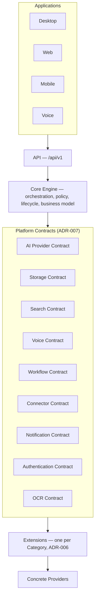
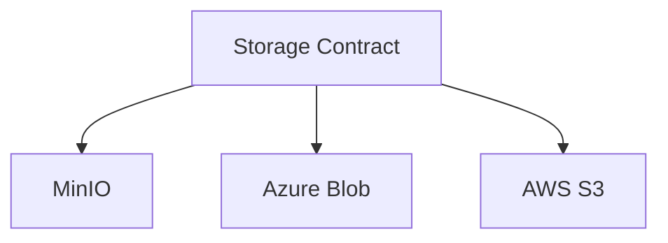

# ADR-007 — Extension Interface & Platform Contracts

| Field | Value |
|---|---|
| Status | **Approved** (2026-07-30, after one focused implementation-consequences review; see [SA-ARCH-999](../SA-ARCH-999_Architecture_Governance.md) §5) |
| Date | 2026-07-30 |
| Related | ADR-006 (Platform Extension Model), ADR-003 (Storage Strategy — the reference precedent), [SA-ROADMAP-001](../SA-ROADMAP-001_Architecture_Roadmap.md) Wave 0 (`B9-iface`) |
| Resolves | *How* something becomes an Extension under ADR-006 — the shared interface shape |

## Context

ADR-006 establishes that Extensions plug into the Core Engine through Platform Contracts, but doesn't specify their shape. A single generic interface for every extension type would either be meaninglessly generic ("execute(payload)") or over-fit to whichever extension type gets designed first — a Storage extension and a Voice extension don't share an operation set. At the same time, extensions of *any* type share real structural needs: how the Core Engine discovers them, what metadata they declare, how their permissions are scoped through the existing `authorize()` gate (ADR-004) rather than a second, parallel permission system.

## Decision

A two-level contract structure.

### Level 1 — Extension Envelope (shared by every Extension, regardless of type)

Every Extension declares:
- **Manifest**: id, name, version, extension type (which Platform Contract it implements), and which Core capability (per [SA-ARCH-011](../SA-ARCH-011_Capability_Map.md)) it extends.
- **Lifecycle hooks**: `register`, `activate`, `deactivate`, `health_check` — mirroring the health-check discipline already established for Core services (`backend/app/routers/v1/health.py`).
- **Permission declaration**: what data/operations the extension needs. Enforced through the *existing* `authorize()` gate (ADR-004) — an extension is just another `resource`/`action` pair to that function, not a second permission system living alongside it.

### Level 2 — Platform Contracts (one per extension type)

| Contract | Core capability it serves | Core operations (illustrative, not final — detailed signatures are implementation, not architecture) |
|---|---|---|
| **Storage Contract** | Storage | put / get / delete / presigned-URL. Already exists de facto — ADR-003 scoped `storage_service.py` to exactly this shape. This ADR formalizes it as the first (retroactive) Platform Contract. |
| **Connector Contract** | Connector Engine | authenticate / read / write / subscribe-to-webhook / resolve-conflict. Detailed semantics (conflict resolution rules, sync vs. webhook model) are `B3`'s implementation-level concern, not restated here. |
| **AI Provider Contract** | AI (AI Gateway) | complete / embed / classify, plus model metadata (context window, supported operations) and a cost-reporting hook so the Gateway can meter usage regardless of provider. |
| **OCR Contract** | OCR | submit / poll / result, with a confidence score and a detected-language field (feeds ADR-008). |
| **Authentication Contract** | Authentication | verify-identity / map-claims-to-user-and-role. For identity providers *beyond* the Core's own username/password + JWT issuance, which stays Core per ADR-006. |
| **Notification Contract** | Notifications | send / delivery-status, plus per-channel capability flags (rich content? read receipts?) so the ACE layer (SA-ARCH-000 §5) can pick appropriately per channel. |
| **Search Contract** | Search | index / query — abstracts keyword vs. vector backends so the vector-search strategy decision (`B2`) plugs in here without changing Search's orchestration. |
| **Voice Contract** | Voice | speech-to-text / text-to-speech / streaming-session lifecycle. |
| **Workflow Contract** | Workflow | *(added on review)* define-steps / advance-step / request-human-approval / evaluate-automation-rule. Covers approval workflows, automation, the reminder engine, and AI-driven workflow steps uniformly, so any of these can be swapped or extended (e.g., a customer's own approval-engine integration) the same way a storage provider can. |

Each contract versions independently (`Major.Minor`, per [SA-ARCH-999](../SA-ARCH-999_Architecture_Governance.md) §6) — e.g., the AI Provider Contract can gain a new optional operation without breaking existing OCR Contract implementations, since they're unrelated contracts.

## Platform Dependency Diagram

Added on review — the one-page visual this ADR (and ADR-006) was missing, showing how a request actually flows from a client down to a concrete provider.

**Worked example — one contract, three interchangeable providers:**

Reading this: the Core Engine never calls MinIO, Azure Blob, or S3 directly — it calls the Storage Contract, and whichever provider is configured underneath fulfills it. This is exactly what `storage_service.py` already does today (ADR-003); every other Platform Contract in the diagram above is this same shape, generalized.

## Alternatives Considered

- **One single generic contract for every extension type.** Rejected: forcing Storage and Voice through the same shape either produces something too abstract to be useful or quietly biases the shape toward whichever extension type was designed first.
- **Per-extension bespoke interfaces with no shared envelope.** Rejected: loses the one consistent manifest/lifecycle/permission model that makes it possible to write the extension loader (Stage 2 implementation) once, instead of once per extension type.
- **A full sandboxed plugin runtime as part of this decision.** Rejected/deferred to `B9-runtime` (SA-ROADMAP-001 Wave 3) — same reasoning as ADR-006 and ADR-004: don't build the generalized, security-sensitive runtime before concrete contract implementations exist to validate it against.

## Consequences

- ADR-003's storage service becomes the reference implementation proving this pattern already works in practice, not a hypothetical.
- The Stage 2 "extension loader" work (see SA-ROADMAP-001 Milestone S2.0) implements the Extension Envelope once; each Platform Contract implementation registers through it.
- Every capability in [SA-ARCH-011](../SA-ARCH-011_Capability_Map.md) that has a corresponding Platform Contract should note which one, once this ADR is Approved (a follow-up edit to that Locked document, not made preemptively while this ADR is still Draft).
- `B3` (Connector Engine design) and future AI/OCR/Voice/Search implementation work now have a concrete contract shape to implement against, rather than inventing one ad hoc when each is built.
